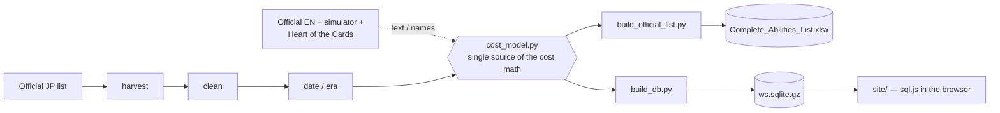

# ws-card-db

**Weiss Schwarz card database & power-cost-per-ability engine.**
Project **1 of 3** in the **WSAI** portfolio ([`ws-sim-ai`](https://github.com/CrisRP-dev/ws-sim-ai) consumes its output).


Weiss Schwarz cards with abilities are printed with **less power** than a plain (ability-less) card of
the same stats — the designer "pays" for each effect by subtracting power. This project **measures that
price** across the entire official card pool, so a **custom-card designer** has a real yardstick:
*"I want this effect → it costs X power."*

```
power_real = power_base − cost                cost is always a multiple of 500
```

## What's in here

| | |
|---|---|
| 🔎 **The pipeline** (`pipeline/`, Python) | Scrapes the official Japanese card list, cleans it, dates every set, attaches English text, and prices every ability: **measured** (isolated on single-ability cards) → **residual** (propagated on multi-ability cards) → **estimated** (family fallback). Fully re-runnable — new sets flow through the same stages. |
| 🌐 **The lookup website** (`site/`) — *the deliverable* | A single static page. Search any of the ~40k cards, filter by type/color/level/trait/title, and open a card to see its **power-budget breakdown**: base power → what each effect spends → printed power → designer residual. No backend — SQLite runs **in the browser** via `sql.js` + `pako`. |

## By the numbers

| Metric | Value |
|---|---|
| JP cards decoded | 63,350 |
| Distinct abilities priced | 15,889 |
| Neo-Standard franchises | 74 |
| Cards live on the site | ~40k (EN + JP) |
| English coverage (names / abilities / traits) | 100% / 100% / 100% |
| Cost-model acceptance (`Explained%`, ±500 tolerance) | ≥ 94% (enforced by `build_db.py`) |
| Validated against the official JP list | ~98% |

*("98%" is a consistency metric, not per-ability correctness — see [`STATUS.md`](STATUS.md) for the live,
per-session accuracy work.)*

## Quick start

```bash
git clone https://github.com/CrisRP-dev/ws-card-db.git
cd ws-card-db
python -m pip install -r requirements.txt   # openpyxl — the entire toolchain

cd site && python -m http.server 8000       # -> http://localhost:8000/
```

The canonical inputs (`cardlist_clean.json`, `cardlist_en.json`, translation stores) and the shipped
`site/ws.sqlite.gz` are committed, so a fresh clone browses the site **without re-scraping anything**.
To rebuild the data yourself (after a cost-model or translation change):

```bash
python pipeline/build_official_list.py   # -> Complete_Abilities_List.xlsx (15,889 abilities)
python pipeline/build_db.py              # -> site/ws.sqlite(.gz), the web app's data
```

Every full command sequence (ingest → translate → build → deploy) and every "how do I…" recipe is in
**[`documentation/RUNBOOK.md`](documentation/RUNBOOK.md)** — written to be followed **by hand, with no AI
assistance**.

## Architecture at a glance



```
ws-card-db/
├── pipeline/              extraction, cleaning, cost model, derived data
│   ├── cost_model.py         ★ single source of the power-cost math
│   ├── build_official_list.py / build_db.py   the two canonical builders (Excel / SQLite)
│   ├── ingest/                harvest -> clean -> date -> era -> features sub-pipeline
│   ├── cost_standardize.py    read-only cost analysis -> pipeline/analysis/
│   └── sources/               official rules & macros (reference, not code)
├── site/                  the static lookup app (deliverable, GitHub-Pages-ready)
├── documentation/         the detailed manuals (below)
└── reference/             official Bushiroad PDFs
```

Full data-flow diagram, the JSON artifact catalogue and the module dependency graph:
**[`documentation/ARCHITECTURE.md`](documentation/ARCHITECTURE.md)**.

## The cost model, in one paragraph

An ability's **package** is its full signature (markers + normalized text — trait lists and character
names collapse to placeholders since they don't change the price). A package's **standard cost** is the
**mode** of its measured per-card deltas, pooled across *all* years — there is **no power-creep at the
package level**; the apparent creep was effect-mix shift. Each card's **residual**
(`real budget − Σ standard costs`) is the designer's unexplained adjustment; `|residual| ≥ 500` flags the
card as a **suspect** worth reviewing. Every cost ships with a confidence level:

- **HIGH** — measured, with ≥3 samples and a mode share ≥60%.
- **MEDIUM** — residual, or measured with weaker evidence.
- **LOW** — estimated from the family median (no reliable mode yet).

Full math, worked examples, and the CX-Combo/replay edge cases: **[`documentation/COST_MODEL.md`](documentation/COST_MODEL.md)**.

## Documentation map

| Doc | Covers |
|---|---|
| [`CLAUDE.md`](CLAUDE.md) | Source of truth for the stack, conventions, and project rules |
| [`documentation/OVERVIEW.md`](documentation/OVERVIEW.md) | What it does, how it works, how it was built — start here |
| [`documentation/ARCHITECTURE.md`](documentation/ARCHITECTURE.md) | Repo map, full data-flow diagram, artifact catalogue, module graph |
| [`documentation/STACK.md`](documentation/STACK.md) | Exact versions, from-scratch setup, external sources & scraping etiquette |
| [`documentation/RUNBOOK.md`](documentation/RUNBOOK.md) | Hands-on, no-AI operator's manual: rebuild, deploy, debug a suspect |
| [`documentation/COST_MODEL.md`](documentation/COST_MODEL.md) | The power-cost math end to end |
| [`documentation/WEBAPP.md`](documentation/WEBAPP.md) | The static site: load sequence, schema contract, cache-busting |
| [`documentation/en-name-matching.md`](documentation/en-name-matching.md) | How English text/names are attached + legacy-set exclusions |
| [`documentation/pump_cost_model.md`](documentation/pump_cost_model.md) | The board-pump ability sub-family in depth |
| [`STATUS.md`](STATUS.md) | Live status: what's done, what's next, resume phrases |

## Conventions (short version)

- Costs are always **multiples of 500** — the game's power economy.
- **Era/release date is metadata only**, never a cost driver (validated: no package-level power-creep).
- Dedup keeps the **base rarity**; alt-art/parallels are discarded.
- All strings are **UTF-8 + NFKC-normalized** (full-width ↔ half-width Japanese fold to one form).
- Every non-trivial line of code carries an inline comment — the repo must stay operable **by hand,
  without AI assistance**.
- This is a personal, no-CI, no-team project: validation is **empirical** (accuracy % + audits), not unit
  tests. Full conventions and the (optional) agent workflow are in [`CLAUDE.md`](CLAUDE.md).

## Ownership

Code is MIT-licensed (see [`LICENSE`](LICENSE)). Card text, names, and images are property of **Bushiroad**
and its respective IP holders; this project only measures and republishes structured metadata about them.
