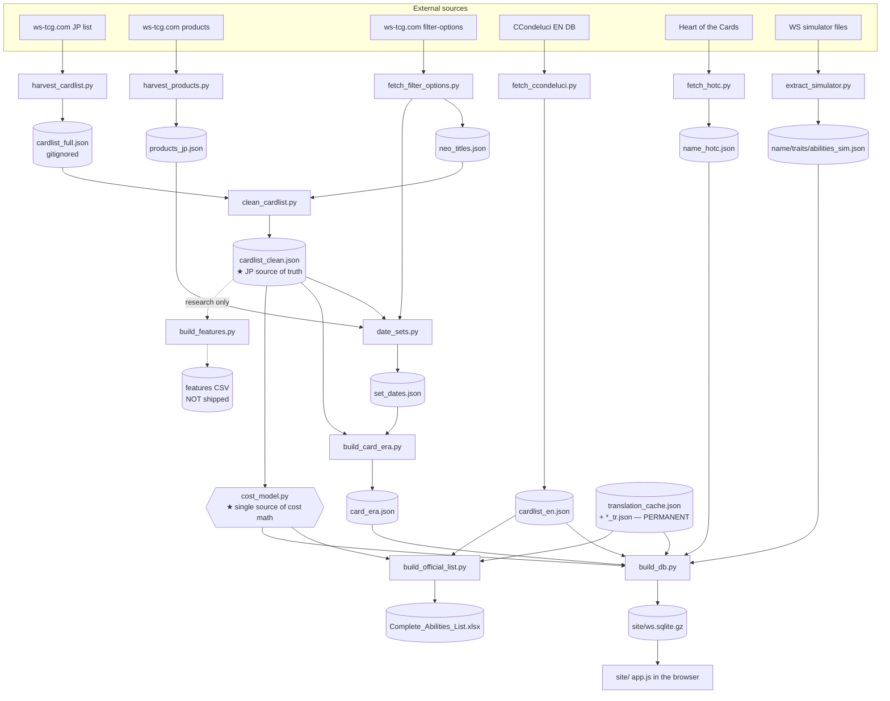

# ARCHITECTURE.md — how the pieces fit together

> The **structural map** of ws-card-db: the two products, where everything lives, how data flows from the
> official sites to the deliverables, which script owns which file, and the module-dependency graph that
> makes `cost_model.py` the single source of cost math. `CLAUDE.md` is the source of truth for the stack;
> this file is the depth behind the structure. Companions: [`STACK.md`](STACK.md) (what to install),
> [`RUNBOOK.md`](RUNBOOK.md) (how to run it), [`COST_MODEL.md`](COST_MODEL.md) (the cost math),
> [`WEBAPP.md`](WEBAPP.md) (the site).

---

## 1. Two products

1. **The pipeline** (Python, `pipeline/`) — scrapes the official Japanese card list, normalizes it, dates
   each set, attaches English text, and computes the **power cost of every ability**. Its outputs are the
   SQLite database (the web's data) and, on demand, Excel cost sheets.
2. **The static lookup website** (`site/`) — the **deliverable**. A backend-free single-page app that loads
   the SQLite in the browser and lets you search any card and see the cost breakdown of each effect.
   Detailed in [`WEBAPP.md`](WEBAPP.md).

Everything else (the analysis scripts, the translation workflow) is support around these two.

## 2. Repo map

```
ws-card-db/
├── CLAUDE.md                     # source of truth for stack + conventions
├── requirements.txt              # openpyxl
├── STATUS.md                     # live status
│
├── pipeline/                     # ── THE PIPELINE ──
│   ├── ingest/                   # sub-pipeline: harvest → clean → date → era → features
│   │   ├── harvest_cardlist.py   #   scrape the JP card list  -> cardlist_full.json (gitignored)
│   │   ├── clean_cardlist.py     #   normalize               -> ../cardlist_clean.json (JP truth)
│   │   ├── fetch_filter_options.py #  taxonomy + neo titles  -> filter_options.json, neo_titles.json
│   │   ├── harvest_products.py   #   JP release dates        -> products_jp.json
│   │   ├── date_sets.py          #   date every set          -> set_dates.json
│   │   ├── eras.py               #   the 6 trigger-debut eras (single source of era boundaries)
│   │   ├── build_card_era.py     #   per-card era projection -> ../card_era.json
│   │   ├── build_features.py     #   research substrate (CSV; NOT on the shipping path)
│   │   └── fetch_ccondeluci.py   #   official EN text        -> ../cardlist_en.json
│   │
│   ├── cost_model.py             # ★ SINGLE SOURCE of the power-cost math (imported by the 2 builders)
│   ├── cost_standardize.py       # read-only cost analysis -> pipeline/analysis/ (does not touch live data)
│   │
│   ├── build_official_list.py    # builder → Complete_Abilities_List.xlsx  (imports cost_model)
│   ├── build_db.py               # builder → site/ws.sqlite(.gz)           (imports cost_model)
│   ├── build_cost_sheet.py       # builder → Ability_Cost_Guide.xlsx       (standalone model guide)
│   ├── build_master_list.py      # ⚠ SUPERSEDED older cost variant (NOT wired to cost_model)
│   ├── official_en.py            # reliable JP-ability → official-EN matcher (helper for the builders)
│   │
│   ├── extract_simulator.py      # simulator EN  -> name_sim/traits_sim/abilities_sim.json
│   ├── fetch_hotc.py             # Heart of the Cards EN names -> name_hotc.json
│   ├── merge_translations.py     # fold agent output into translation_cache.json (PERMANENT)
│   ├── _tr_extract.py            # extract untranslated strings -> _tr_batches/ (gitignored)
│   ├── _tr2_extract.py           # extract remaining untranslated -> _tr2/ (gitignored)
│   │
│   └── *.json                    # canonical inputs + translation stores (see the catalogue in §4)
│
├── site/                         # ── THE WEB APP (deliverable) ──
│   ├── index.html  app.js  style.css
│   └── ws.sqlite.gz              # the shipped data (gzipped; ws.sqlite itself is gitignored)
│
├── documentation/                # this folder — the detailed docs
├── reference/                    # official Bushiroad PDFs (reference material, not code)
└── pipeline/sources/             # official rules/manuals (reference material, not code)
```

## 3. Data flow

The arrows are "produces / feeds". The **ingest sub-pipeline** runs left-to-right; then the **cost model**
runs inside each **builder**; then the **site** consumes the SQLite.



**In words:** *harvest → clean → date/era → (cost_model inside the builders) → build_db / build_official_list → site.*
`build_features.py` is a **side branch** — a research substrate for formula auto-discovery; nothing on the
shipping path reads its CSVs.

## 4. JSON artifact catalogue

Which script **writes** each artifact, which **read** it, and whether git tracks it. "Tracked" files are
committed so a fresh clone can build without re-scraping; "regenerable" files are in `.gitignore`.

### Canonical data (tracked — the committed inputs)
| Artifact | Written by | Read by | Notes |
|---|---|---|---|
| `pipeline/cardlist_clean.json` | `ingest/clean_cardlist.py` | **all builders**, `date_sets.py`, `build_card_era.py`, `build_features.py`, `_tr*_extract.py`, `extract_simulator.py`, `official_en.py` | **JP source of truth** (~63k cards) |
| `pipeline/cardlist_en.json` | `ingest/fetch_ccondeluci.py` | `build_db.py`, `build_official_list.py`, `build_master_list.py`, `official_en.py`, `_tr_extract.py` | Official EN card text |
| `pipeline/card_era.json` | `ingest/build_card_era.py` | `build_db.py`, `build_official_list.py`, `build_master_list.py` | `{card_number: era}` — **metadata only**, not a cost driver |
| `pipeline/ingest/set_dates.json` | `ingest/date_sets.py` | `build_card_era.py`, `build_features.py`, `build_db.py` (release dates) | Per-set release date + era |
| `pipeline/ingest/filter_options.json` | `ingest/fetch_filter_options.py` | `date_sets.py` | Raw expansion taxonomy |
| `pipeline/ingest/neo_titles.json` | `ingest/fetch_filter_options.py` | `clean_cardlist.py`, `build_db.py` | Neo-Standard franchise → card codes |
| `pipeline/ingest/products_jp.json` | `ingest/harvest_products.py` | `date_sets.py` | JP release dates (发売日) |
| `pipeline/ingest/cardlist_audit.json` | `ingest/clean_cardlist.py` | (humans / validation) | Decoding audit |

### Translation stores (tracked)
| Artifact | Written by | Read by | Notes |
|---|---|---|---|
| `pipeline/translation_cache.json` | `merge_translations.py` | `build_db.py`, `build_official_list.py`, `_tr_extract.py` | **PERMANENT — never delete** (JP-keyed, survives any methodology change) |
| `pipeline/variant_tr_full.json` | (agent bilingual pass) | `build_db.py`, `_tr_extract.py` | ~15.9k complete JP→EN ability set |
| `pipeline/abilities_tr.json` / `name_tr.json` / `trait_tr.json` | (agent bilingual pass) | `build_db.py`, `_tr_extract.py` | LLM translations (abilities/names/traits) |
| `pipeline/abilities_official_en.json` | `_tr_extract.py` | `build_db.py` | Official EN abilities propagated by text |
| `pipeline/name_sim.json` / `traits_sim.json` / `abilities_sim.json` | `extract_simulator.py` | `build_db.py` | Unofficial-simulator EN (JP-only gap filler) |
| `pipeline/name_hotc.json` | `fetch_hotc.py` | `build_db.py` | JP-aligned EN names (correct for renumbered legacy sets) |
| `pipeline/neo_en.json` | (curated) | `build_db.py` | Official EN franchise titles |

### Regenerable / transient (gitignored — rebuilt by the pipeline)
| Artifact | Written by | Read by | Notes |
|---|---|---|---|
| `pipeline/ingest/cardlist_full.json` (+ `.jsonl`/`.state.json`) | `harvest_cardlist.py` | `clean_cardlist.py` | Raw harvest (~59 MB) |
| `pipeline/ingest/features_by_card.csv` / `variant_era_cost.csv` | `build_features.py` | (research only) | ~73 MB substrate; **not shipped** |
| `pipeline/to_translate.json` + `_tr/chunk_*.json` | `build_official_list.py` | `merge_translations.py` | Per-run translation requests |
| `pipeline/_tr_batches/` + `_tr_manifest.json` | `_tr_extract.py` | translation workflow | Batched strings to translate |
| `pipeline/_tr2/` | `_tr2_extract.py` | translation workflow | Remaining strings to translate |
| `pipeline/analysis/*` | `cost_standardize.py` | (humans) | Read-only cost analysis outputs |
| `pipeline/*.xlsx` | `build_official_list.py`, `build_cost_sheet.py` | (humans) | Excel deliverables, on demand |
| `site/ws.sqlite` | `build_db.py` | `build_db.py` (gzips it) | Uncompressed DB (the `.gz` IS tracked) |

## 5. Module dependency graph (the cost math is single-sourced)

```
                         ┌───────────────────┐
                         │  cost_model.py    │  ★ the ONLY implementation of the
                         │  build_cost_model │    power-cost math (measured →
                         │  en_cost_model    │    residual → estimated, replay
                         └─────────┬─────────┘    folding, CX-combo, EN pass)
                        imports    │    imports
                 ┌─────────────────┴──────────────────┐
                 ▼                                     ▼
   ┌───────────────────────────┐        ┌───────────────────────────┐
   │  build_official_list.py   │        │       build_db.py         │
   │  (Excel I/O around it)    │        │  (SQLite I/O around it)    │
   │  + imports official_en.py │        │  + inline EN matching      │
   └───────────────────────────┘        └───────────────────────────┘
                 │                                     │
                 ▼                                     ▼
     Complete_Abilities_List.xlsx            site/ws.sqlite(.gz)  →  the web app
```

**Key invariant:** both shipping builders call `build_cost_model(clean)` and read costs off the returned
object. Neither reimplements the math. If the cost model changes, edit **only** `cost_model.py` and re-run
the builders. See [`COST_MODEL.md`](COST_MODEL.md) for what happens inside that box.

## 6. Superseded / out-of-scope (do not treat as canonical)

| Item | Status | Why |
|---|---|---|
| `pipeline/build_master_list.py` | **Superseded** | An older, self-contained cost variant. No CX-combo, no replay folding, different family labels, its own private (drifted) cost math — **not** wired to `cost_model.py`. It also writes the *same* filename as `build_official_list.py`, so running it overwrites the canonical Excel. Kept only for reference. Canonical builders are `build_official_list.py` + `build_db.py`. |
| `pipeline/_tr_batches/`, `pipeline/_tr2/`, `pipeline/_tr/` | **Transient/gitignored** | Translation-workflow scratch. The JP→EN translation pass is **done** (100%, per project memory); these are only used when refreshing translations for a new set. |
| `pipeline/ingest/build_features.py` | **Research substrate** | Feeds an offline formula-auto-discovery experiment (feature CSVs). Nothing on the shipping path consumes it. Still uses the old binary legacy/modern era split. |
| `pipeline/sources/`, `reference/` | **Reference material** | Official rules/manuals/PDFs — not code, not touched by the build. |
| `wsai/analisis/` (elsewhere in the portfolio) | **Out of scope** | The original workshop; **this** repo is the clean canonical version. Edit the pipeline here, not there. |

## To go deeper
- What to install → [`STACK.md`](STACK.md)
- How to run every stage → [`RUNBOOK.md`](RUNBOOK.md)
- The cost math inside `cost_model.py` → [`COST_MODEL.md`](COST_MODEL.md)
- The web app → [`WEBAPP.md`](WEBAPP.md)
- EN matching & legacy disparity → [`en-name-matching.md`](en-name-matching.md)
